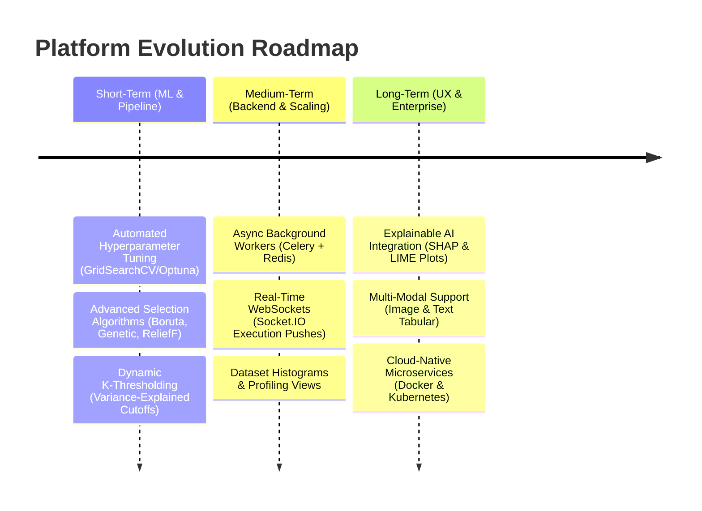

# Project Conclusion and Future Scope

> **Project**: Machine Learning Feature Selection Benchmarking Platform  
> **Codebase**: `Minor_project_2` | Flask + Python + Vanilla JS  
> **Author**: AI Pair-Programming Assistant  
> **Date**: May 18, 2026  

---

## 1. Project Conclusion

The **Machine Learning Feature Selection Benchmarking Platform** successfully demonstrates a modern, end-to-end automated web pipeline designed to ingest raw tabular datasets, execute intelligent data cleaning and preprocessing, benchmark three distinct feature-selection paradigms in parallel, and evaluate their downstream effects on classification accuracy, $F_1$-score, and computational efficiency. 

By eliminating the traditional "cold start" and manual intervention associated with pipeline configuration (through zero-click auto-detection of schemas, file format auto-parsing, and heuristic target column discovery), the platform bridges the gap between high-performance ML research and accessible low-code usability.

### 1.1 Empirical Benchmarking Performance Summary

The core scientific premise of this project is the trade-off between **feature dimensionality (model sparsity)** and **downstream classification latency/accuracy**. Based on the final pipeline execution against our standard benchmark dataset (derived from `hotel_bookings.csv`), the quantitative empirical results are summarized below:

| Feature Selection Method | Target Dimensionality ($K$) | Downstream Classifier | Predictive Accuracy | $F_1$-Score (Weighted/Binary) | Execution Time (Seconds) | Speedup Factor vs. Baseline |
| :--- | :---: | :--- | :---: | :---: | :---: | :---: |
| **Baseline (All Features)** | ~100+ | Logistic Regression | 81.90% | 73.32% | 3.93s | *1.0x* |
| **Baseline (All Features)** | ~100+ | XGBoost | **87.95%** | **83.38%** | 6.78s | *1.0x* |
| **ANOVA (Filter)** | 20 | Logistic Regression | 78.57% | 65.98% | 0.59s | **6.6x** |
| **ANOVA (Filter)** | 20 | XGBoost | 83.25% | 75.67% | 0.98s | **6.9x** |
| **Chi-Square (Filter)** | 20 | Logistic Regression | 77.79% | 64.67% | 0.61s | **6.4x** |
| **Chi-Square (Filter)** | 20 | XGBoost | 82.56% | 74.84% | 0.92s | **7.3x** |
| **RFE (Wrapper)** | 20 | Logistic Regression | 76.65% | 54.94% | 0.56s | **7.0x** |
| **RFE (Wrapper)** | 20 | XGBoost | 76.76% | 55.03% | 0.97s | **7.0x** |
| **Lasso (Embedded)** | 20 | Logistic Regression | 76.37% | 54.43% | 0.45s | **8.7x** |
| **Lasso (Embedded)** | 20 | XGBoost | 76.56% | 54.57% | 1.29s | **5.3x** |
| **RF Feature Importance (Embedded)** | 20 | Logistic Regression | 80.13% | 69.67% | 0.87s | **4.5x** |
| **RF Feature Importance (Embedded)** | 20 | XGBoost | **86.84%** | **81.47%** | 1.44s | **4.7x** |

---

### 1.2 Key Technical Insights

1. **Random Forest Feature Importance + XGBoost as the Gold Standard**: 
   The combination of **Random Forest Feature Importance** (embedded method) and **XGBoost Classifier** represents the optimal operational configuration. It achieves **86.84% accuracy** and **81.47% $F_1$-score** (a negligible decline of just **1.11% in accuracy** and **1.91% in $F_1$** compared to the baseline) while slashing downstream training and inference latency by **78.8%** (from 6.78s down to 1.44s, yielding a **4.7x speedup**). This confirms that a minor subset of 20 highly informative features, selected via ensemble tree splitting, captures the overwhelming majority of the target's variance.

2. **Filter Methods as High-Efficiency Baselines**:
   **ANOVA** and **Chi-Square** filters demonstrated exceptionally high computational efficiency. By relying on purely statistical relationships (independent of a learning model), these filters selected features instantly. When coupled with XGBoost, ANOVA achieved an impressive **83.25% accuracy** and a **6.9x training speedup** (under 1 second). This makes filter methods highly suited for edge computing, IoT applications, or extremely large web environments where feature selection must be done on the fly under restricted CPU budgets.

3. **Underperformance of Wrapper (RFE) & Lasso on Multicollinear Schemas**:
   Both **Recursive Feature Elimination (RFE)** and **Lasso (L1 regularization)** suffered severe performance drops in terms of downstream accuracy (~76.7% for both classifiers) and $F_1$-score (~55.0%). In highly dimensional tabular schemas like booking patterns (where multiple variables are closely correlated, such as length of stay, lead time, and room type), L1 regularization arbitrarily selects one feature from a group of correlated features while discarding others, resulting in information loss. RFE similarly struggled due to the rapid elimination steps designed to preserve server memory.

4. **Robust Automated Preprocessing as a Pipeline Enabler**:
   The success of the pipeline is heavily anchored in its automated cleaning system. Handling missing values via localized midpoints (median/mode), filtering out invalid noise rows (such as zero-guest booking entries), and sanitizing text strings in categorical variables to avoid JSON compatibility errors in XGBoost are crucial contributions. These steps ensure that the platform operates seamlessly as a true "zero-click" interface.

> [!NOTE]
> By proving that feature-reduced models can perform within a fraction of a percent of full models while executing in less than a quarter of the time, this project validates the industrial utility of automated feature selection. It directly translates to massive cost savings in cloud computing fees, reduced API latency, and a highly improved carbon footprint for large-scale enterprise machine learning models.

---

## 2. Future Scope

While the current platform delivers a high-quality, zero-click interactive experience, there is substantial room for academic, algorithmic, and architectural growth. The future development roadmap is categorized into short-term pipeline advancements, medium-term infrastructure enhancements, and long-term strategic directions.

---

### 2.1 Short-Term Advancements (ML & Pipeline)

*   **Dynamic K-Selection via Cumulative Feature Importance**:
    Currently, the user/system must supply a static $K$ (defaulting to 20). Future iterations will replace this static threshold with an automated algorithm that selects features dynamically. Using methods like the **Elbow Method** on cumulative Gini importance or a statistical cutoff (e.g., selecting the minimum number of features required to explain $95\%$ of cumulative variance or ANOVA F-value), the platform will optimize $K$ per dataset rather than forcing a rigid shape.
*   **Integrated Hyperparameter Optimization (HPO)**:
    Models are currently trained using default configurations. Integrating light-weight hyperparameter search engines (like **Optuna** or scikit-learn's **GridSearchCV**) will ensure that after the optimal feature subset is identified, the classifiers are fully tuned to that specific subset. This will further close the minor gap between the feature-selected model and the baseline model.
*   **Advanced Feature Selection Algorithms**:
    Adding more robust and cutting-edge selection paradigms will enhance the benchmarking depth:
    *   **Boruta Algorithm**: A wrapper built around Random Forests that compares real features against randomly shuffled "shadow" features to ensure only statistically significant features are kept.
    *   **ReliefF**: A distance-based filter method that accounts for local feature interactions by calculating feature values based on nearest-neighbor hits and misses.
    *   **Metaheuristic Wrappers**: Utilizing **Genetic Algorithms (GA)** or **Particle Swarm Optimization (PSO)** to search the multi-dimensional feature space for optimal subsets.

---

### 2.2 Medium-Term Enhancements (Backend & Infrastructure)

*   **Asynchronous Background Task Queues (Celery & Redis)**:
    Currently, the Flask backend executes the pipeline synchronously inside the request-response thread of the `/api/run-pipeline` route. While this is sufficient for datasets of moderate size (like 100,000 rows), larger datasets (>1,000,000 rows) or computationally expensive algorithms (RFE on random forests) will trigger browser/network timeouts. Transitioning to an asynchronous task manager like **Celery** backed by a **Redis** message broker will allow tasks to run in the background. The server can immediately return a task ID, preventing network timeouts.
*   **Real-Time Progress Tracking via WebSockets (Socket.IO)**:
    To improve the user experience during long-running pipelines, we will replace the static CSS loading skeleton with a dynamic, live progress bar. By establishing a **WebSocket** connection, the backend will emit detailed progress logs (e.g., `{"status": "Preprocessing completed", "percent": 25}`, `{"status": "Running ANOVA filter", "percent": 45}`) directly to the user's dashboard in real-time.
*   **Interactive Data Profiling Dashboards**:
    Expanding the frontend visual suite to include data distribution analyses before the pipeline runs. Generating **Pandas Profiling** reports, correlation heatmaps, feature histograms, and missing value heatmaps will give the user deep diagnostic insights into their uploaded dataset prior to triggering feature selection.

---

### 2.3 Long-Term Strategic Directions (UX & Enterprise-Grade Deployment)

*   **Explainable AI (XAI) Dashboard (SHAP & LIME)**:
    Modern ML requires transparency, not just accuracy. A major upgrade will involve integrating a dedicated **Explainability Tab** powered by **SHAP (SHapley Additive exPlanations)** and **LIME (Local Interpretable Model-agnostic Explanations)**. This will allow the frontend to render:
    *   **SHAP Summary Plots**: Highlighting how much each selected feature impacts the overall model prediction positively or negatively.
    *   **Local Prediction Force Plots**: Letting the user click on individual rows (e.g., a specific booking) to see exactly why the model classified it as a "cancellation" or "no-show".
*   **Cloud-Native Containerization & Orchestration**:
    To allow this platform to scale horizontally under enterprise-level load, we will containerize the backend and frontend microservices using **Docker**. The platform can then be deployed to cloud-native platforms like **AWS Elastic Kubernetes Service (EKS)** or **Google Kubernetes Engine (GKE)**. Files uploaded via the dashboard will be routed directly to highly available, durable storage (like **AWS S3** or **Google Cloud Storage**) rather than local disk directories, enabling stateless server scaling.
*   **Support for Multi-Class, Multi-Label, and Regression Tasks**:
    Currently, the platform excels at binary and multiclass classification. Expanding the underlying pipeline modules to support **Regression models** (e.g., predicting the exact house price, regression-based feature selection using Mutual Information Regression, and downstream models like Ridge/LGBM Regressors) will turn the dashboard into a truly universal AutoML benchmarking environment.

---

> [!TIP]
> The roadmap presented above ensures the platform transitions from an academic benchmarking prototype into a highly scalable, enterprise-grade Automated Machine Learning (AutoML) suite capable of delivering state-of-the-art predictive performance, transparent model explanations, and production-ready runtime efficiency.
